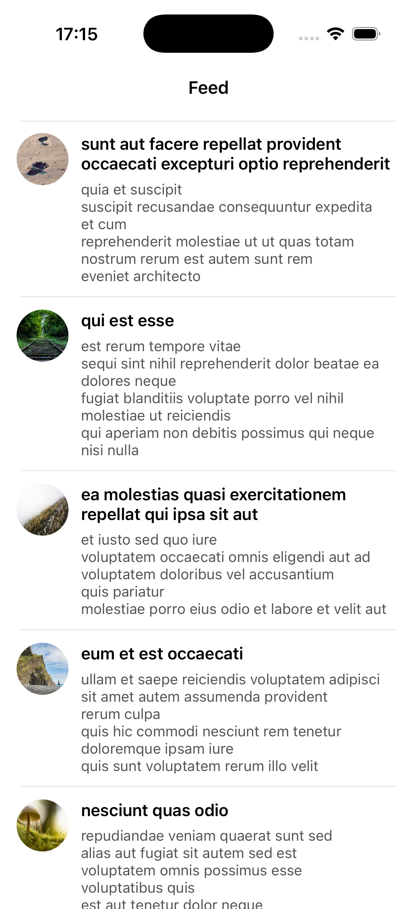

# SocialFeed

Упрощённая лента социальной сети с поддержкой онлайн/оффлайн режима.
Приложение построено без сторибордов, с использованием MVVM, CoreData, Alamofire и UIKit.

---

## Описание архитектуры

Проект построен по принципам **Clean Architecture + MVVM** и разделён на несколько независимых слоёв.

### **1. Data Layer**
Отвечает за работу с внешними источниками:

#### Network
- `APIClient` — обёртка над Alamofire, выполняющая HTTP-запросы.
- `PostsAPIService` — загрузка постов с JSONPlaceholder.
- `PostsEndpoint` — конфигурация URLRequest через `URLRequestConvertible`.

#### Storage (CoreData)
- `CoreDataManager` — инициализация NSPersistentContainer.
- `PostEntity` — модель хранения данных.
- `PostsRepository` — асинхронная работа с CoreData.
- `PostMapper` — трансформация:
  - DTO → Domain
  - Domain → Entity
  - Entity → Domain

Data слой не зависит от UI и Domain.

---

### **2. Domain Layer**
Содержит бизнес-логику и чистые модели.

- `PostModel` — модель данных, используемая ViewModel.
- `PostsService` — загружает данные из сети, маппит их, сохраняет в CoreData.
- `PostsServiceProtocol` — интерфейс сервиса.

Domain слой не использует UIKit, Alamofire или CoreData.

---

### **3. Presentation Layer** (MVVM + UIKit)
Отвечает за отображение данных.

- `FeedViewModel` — логика экрана, управление состоянием, загрузка данных.
- `FeedViewController` — UI, таблица, pull-to-refresh.
- `PostTableViewCell` — отображение одного поста (заголовок, текст, аватар).

ViewModel использует только Domain Model — без DTO и Entity.

---

### **4. DI Layer**
`DIContainer` — единая точка сборки зависимостей.

Собирает:
- CoreData stack
- API client
- API services
- Repository
- Domain services
- ViewModel
- ViewController

---

## Скриншоты

---

## Использованные технологии

| Технология | Описание |
|-----------|----------|
| **Swift** | основной язык |
| **UIKit** | UI без сторибордов |
| **AutoLayout (кодом)** | адаптивная верстка |
| **Alamofire** | сетевой слой |
| **CoreData** | оффлайн-кэш |
| **Clean Architecture** | разделение на слои |
| **MVVM** | архитектура презентационного слоя |
| **Dependency Injection** | DIContainer |
| **JSONPlaceholder** | источник данных |
| **Lorem Picsum** | генерация аватаров |

---

## Инструкция по сборке и запуску

Собрать: ⌘ + B

Запустить: ⌘ + R

